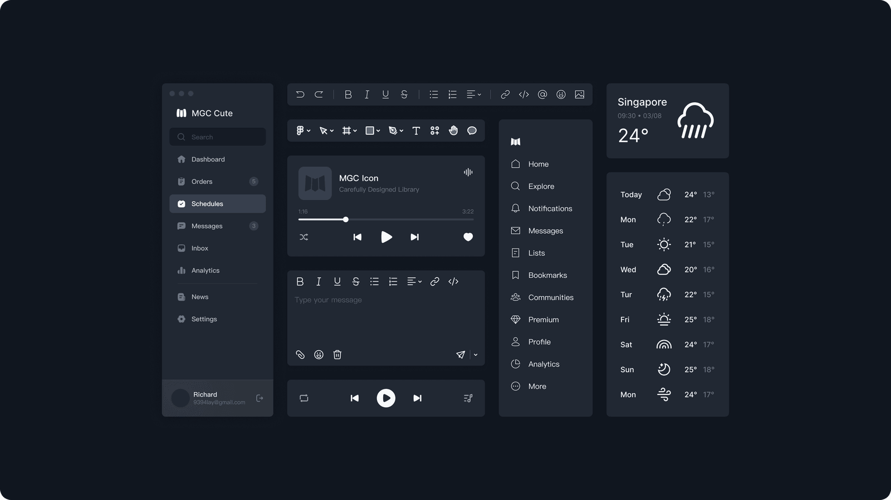
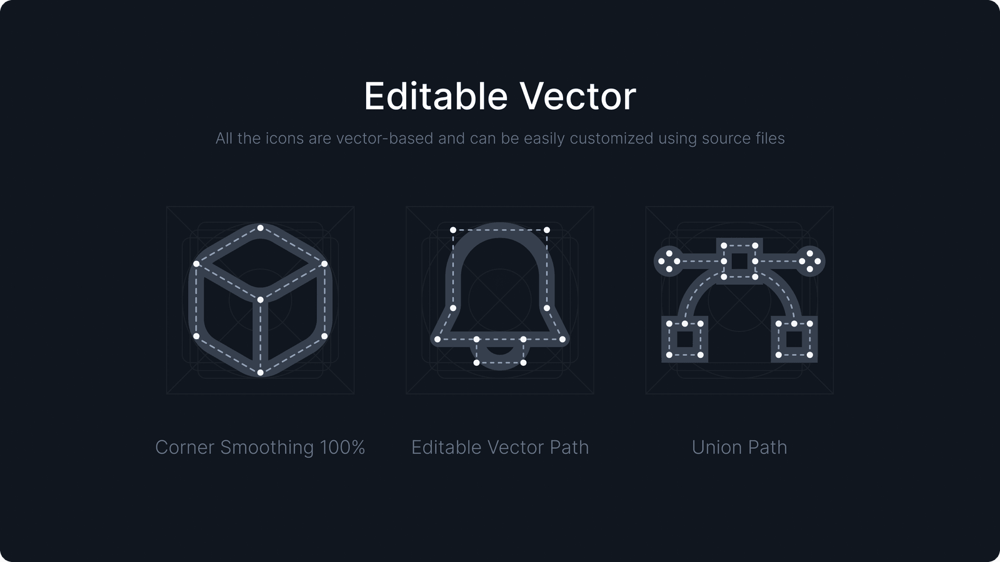

<a href="https://www.mingcute.com/">
  
</a>

<h1 align="center">Mingcute Icons</h1>

<h3 align="center">Carefully Designed Icon Library</h3>

<p align="center">
  <a href="https://www.mingcute.com/"></a>&nbsp;
  <a href="https://www.npmjs.com/package/@mingcute/icons"></a>&nbsp;
  <a href="https://bundlephobia.com/package/@mingcute/icons"></a>&nbsp;
  <a href="https://www.npmjs.com/package/@mingcute/icons"></a>&nbsp;
  <a href="https://github.com/mingcute-design/mingcute-icons/stargazers"></a>
</p>

---

## Overview

Mingcute Icons is the public, open-source distribution of the Mingcute Icon System.

It provides **1,663 icons** in both Core Regular and Core Filled, for a total of **3,326 styled icon definitions**, distributed across 10 production packages for:

* React
* Vue
* React Native
* Svelte
* SolidJS
* Vanilla JavaScript
* Web Components
* Standalone SVG
* WOFF2 icon fonts
* Framework-neutral definitions

Every renderer uses the same generated `@mingcute/icons` definitions. Icon geometry is compiled once rather than duplicated across framework packages, keeping rendering consistent and the repository easier to maintain.

## Highlights

* **3,326 styled definitions:** 1,663 icons in Core Regular and Core Filled.
* **10 production packages:** framework components, SVG, fonts, and framework-neutral definitions.
* **Consistent rendering:** every package is generated from the same canonical artwork.
* **Tree-shakeable imports:** use style entry points for convenience or direct icon paths for smaller module graphs.
* **Accessible behavior:** components remain decorative unless given an accessible title or label.
* **Typed packages:** framework adapters include generated declarations and typed component props.
* **High-fidelity SVG:** gradients, masks, clipping paths, and self-contained patterns are preserved.
* **No duplicated geometry:** framework adapters consume `@mingcute/icons`.

<a href="https://www.mingcute.com/">
  
</a>

## Design Foundation

Every Mingcute icon is drawn on a 24 × 24 grid with consistent visual proportions.

The public catalogue includes:

* Core Regular
* Core Filled

Core Regular is designed around a consistent 2 px stroke. Canonical vector artwork remains editable in the source files and scales through SVG without losing its intended proportions.

Use the [Mingcute website](https://www.mingcute.com/) to:

* search the icon catalogue;
* preview icons;
* adjust icon size and color; and
* download individual SVG or PNG assets.

Use the packages in this repository when icons need to be installed, versioned, tree-shaken, and rendered consistently in an application.



## Quick Start

### 1. Install the package for your framework

For React:

```bash
npm install @mingcute/react
```

For another framework, replace `@mingcute/react` with the appropriate package listed below.

### 2. Import an icon

```tsx
import { Home1Regular } from '@mingcute/react/core-regular';

export function HomeLink() {
  return (
    <a href="/">
      <Home1Regular size={20} aria-hidden="true" />
      <span>Home</span>
    </a>
  );
}
```

## Packages

Install only the package required by your project.

| Target             | Package                                                           | Installation                           | Purpose                                             |
| ------------------ | ----------------------------------------------------------------- | -------------------------------------- | --------------------------------------------------- |
| Icon definitions   | [`@mingcute/icons`](./packages/icons/README.md)                   | `npm install @mingcute/icons`          | Framework-neutral definitions and rendering helpers |
| React              | [`@mingcute/react`](./packages/react/README.md)                   | `npm install @mingcute/react`          | Typed React SVG components                          |
| Vue                | [`@mingcute/vue`](./packages/vue/README.md)                       | `npm install @mingcute/vue`            | Typed Vue 3 SVG components                          |
| React Native       | [`@mingcute/react-native`](./packages/react-native/README.md)     | `npm install @mingcute/react-native`   | Native components using `react-native-svg`          |
| Svelte             | [`@mingcute/svelte`](./packages/svelte/README.md)                 | `npm install @mingcute/svelte`         | Svelte 5 icon components                            |
| SolidJS            | [`@mingcute/solid`](./packages/solid/README.md)                   | `npm install @mingcute/solid`          | SolidJS icon components                             |
| Vanilla JavaScript | [`@mingcute/vanilla`](./packages/vanilla/README.md)               | `npm install @mingcute/vanilla`        | SVG strings and DOM helpers                         |
| Web Components     | [`@mingcute/web-components`](./packages/web-components/README.md) | `npm install @mingcute/web-components` | Explicitly registered custom elements               |
| SVG                | [`@mingcute/svg`](./packages/svg/README.md)                       | `npm install @mingcute/svg`            | Optimized standalone SVG files                      |
| Font               | [`@mingcute/font`](./packages/font/README.md)                     | `npm install @mingcute/font`           | WOFF2 fonts, CSS classes, and metadata              |

Framework packages use `@mingcute/icons` for shared icon geometry. The definitions package is installed automatically when required.

### Package-manager examples

```bash
# npm
npm install @mingcute/react

# pnpm
pnpm add @mingcute/react

# Yarn
yarn add @mingcute/react

# Bun
bun add @mingcute/react
```

## Available Styles

The public release contains **3,326 styled icon definitions** across two importable styles.

| Import subpath | Style                 |     Icons |
| -------------- | --------------------- | --------: |
| `core-regular` | Core Regular          |     1,663 |
| `core-filled`  | Core Filled           |     1,663 |
| **Total**      | **All public styles** | **3,326** |

Additional Core, Cute, and Sharp styles are available in [Mingcute Pro](https://www.mingcute.com/).

## Free and Pro

| Capability          | Mingcute Icons               | Mingcute Pro                                 |
| ------------------- | ---------------------------- | -------------------------------------------- |
| Families and styles | Core Regular and Core Filled | 12 Core, Cute, and Sharp style combinations  |
| Styled definitions  | 3,326                        | 20,152                                       |
| Package names       | `@mingcute/*`                | `@mingcute/*-pro`                            |
| Distribution        | Public npm registry          | Private Mingcute registry                    |
| Access              | No account or CLI required   | Active Pro entitlement and CLI configuration |
| License             | Apache-2.0                   | Mingcute Pro Commercial License              |

The public and Pro packages use the same framework conventions and import structure. This makes migration straightforward while keeping the source repositories and licensing boundaries separate.

## Usage

### React

```tsx
import { Home1Regular } from '@mingcute/react/core-regular';

export function HomeIcon() {
  return <Home1Regular size={24} title="Home" />;
}
```

### Vue

```vue
<script setup lang="ts">
import { Home1Filled } from '@mingcute/vue/core-filled';
</script>

<template>
  <Home1Filled :size="24" title="Home" />
</template>
```

### React Native

```tsx
import { Home1Regular } from '@mingcute/react-native/core-regular';

export function HomeIcon() {
  return <Home1Regular size={24} color="#10161F" title="Home" />;
}
```

React Native requires `react-native-svg` 13 or newer.

### Svelte

```svelte
<script>
  import { Home1Regular } from '@mingcute/svelte/core-regular';
</script>

<Home1Regular size={24} title="Home" />
```

### SolidJS

```tsx
import { Home1Regular } from '@mingcute/solid/core-regular';

export function HomeIcon() {
  return <Home1Regular size={24} title="Home" />;
}
```

### Vanilla JavaScript

```ts
import { createIcon } from '@mingcute/vanilla';
import { Home1Regular } from '@mingcute/vanilla/core-regular';

const navigation = document.querySelector('nav');

navigation?.append(
  createIcon(Home1Regular, {
    size: 24,
    title: 'Home',
  }),
);
```

### Web Components

Register the component:

```js
import { defineHome1Regular } from '@mingcute/web-components/core-regular/home-1';

defineHome1Regular();
```

Use the registered custom element:

```html
<mingcute-home-1-regular
  size="24"
  title="Home"
></mingcute-home-1-regular>
```

### Standalone SVG

```ts
import homeUrl from '@mingcute/svg/core-regular/home-1.svg';
```

### Icon Font

Import the stylesheet:

```js
import '@mingcute/font/core-regular.min.css';
```

Use the generated class:

```html
<i class="mgc mgc-home-1-regular" aria-hidden="true"></i>
```

### Framework-Neutral Definitions

```ts
import { renderIconSource } from '@mingcute/icons';
import { Home1Icon } from '@mingcute/icons/core-regular';

const svg = renderIconSource(Home1Icon);
```

## Package Model

`@mingcute/icons` contains the framework-neutral icon definitions.

Framework packages provide small renderer-specific wrappers and install the shared definitions automatically:

```text
@mingcute/icons
├── @mingcute/react
├── @mingcute/vue
├── @mingcute/react-native
├── @mingcute/svelte
├── @mingcute/solid
├── @mingcute/vanilla
└── @mingcute/web-components
```

This structure prevents icon geometry from being duplicated across framework packages.

The standalone SVG and font packages are generated from the same canonical artwork and validated independently.

## Import Strategy

### Style entry points

Use a style entry point for convenient named imports:

```ts
import {
  Home1Regular,
  Search2Regular,
} from '@mingcute/react/core-regular';
```

### Direct icon imports

Use a direct icon path for the smallest module graph:

```ts
import Home1Regular from '@mingcute/react/core-regular/home-1';
```

Package roots expose shared utilities and types rather than the complete icon catalogue. This prevents accidental imports of every icon.

## Performance and Module Format

Mingcute JavaScript packages:

* are ESM-only;
* publish explicit export maps;
* support tree shaking; and
* declare side effects only where required.

JavaScript packages declare `sideEffects: false`.

`@mingcute/font` marks imported CSS as side-effectful so bundlers retain the stylesheet.

For predictable bundle sizes:

* use direct icon imports in shared libraries and performance-sensitive entry points;
* avoid namespace imports from style entry points;
* code-split icon-heavy features with their application routes;
* use your framework’s bundle analyzer to verify production output; and
* prefer SVG components over icon fonts when gradients, masks, patterns, or original colors must be preserved.

## Accessibility

Framework components are decorative by default and remain hidden from assistive technology unless they receive an accessible title or label.

The examples below use these React imports:

```tsx
import {
  Home1Regular,
  MenuRegular,
} from '@mingcute/react/core-regular';
```

### Meaningful icons

Provide a title when an icon communicates meaning by itself:

```tsx
<Home1Regular size={24} title="Home" />
```

### Decorative icons

Keep decorative icons hidden from assistive technology:

```tsx
<Home1Regular size={24} aria-hidden="true" />
```

### Icons inside labelled controls

When visible text already labels a button or link, the icon should normally remain decorative:

```tsx
<button type="button">
  <Home1Regular size={20} aria-hidden="true" />
  <span>Home</span>
</button>
```

### Icon-only controls

Give the control an accessible name and keep the icon decorative:

```tsx
<button type="button" aria-label="Open navigation">
  <MenuRegular size={20} aria-hidden="true" />
</button>
```

Do not rely on an icon’s shape or color alone to communicate an action, status, or meaning.

## Rendering

The compiler preserves supported SVG features, including:

* standard SVG geometry;
* gradients;
* masks;
* clipping paths; and
* self-contained image patterns.

Resource identifiers are scoped per rendered instance to prevent collisions when the same icon appears more than once on a page.

Icon fonts cannot reproduce every SVG feature. Use the SVG or framework packages when exact gradients, masks, patterns, or original colors are required.

## Compatibility

| Package                          | Supported runtime                                              |
| -------------------------------- | -------------------------------------------------------------- |
| `@mingcute/react`                | React 18 or 19                                                 |
| `@mingcute/vue`                  | Vue 3.5 or newer                                               |
| `@mingcute/react-native`         | React 18+, React Native 0.72+, and `react-native-svg` 13+      |
| `@mingcute/svelte`               | Svelte 5.20 or newer                                           |
| `@mingcute/solid`                | SolidJS 1.9.x                                                  |
| Vanilla, Web Components, and SVG | Modern ESM toolchains and standards-compliant SVG environments |
| Font                             | Modern browsers with WOFF2 support                             |

Repository development requires:

* Node.js 22 or newer
* pnpm 9.15.0

Consumer applications do not need pnpm unless they are contributing to this repository.

## Troubleshooting

### An icon import cannot be resolved

Confirm:

* the package name;
* the style subpath;
* the component name; and
* the direct icon filename, when applicable.

Component exports use PascalCase with a style suffix:

```ts
Home1Regular
```

Direct icon filenames use kebab-case:

```text
home-1
```

### The production bundle is larger than expected

Use a direct icon import:

```ts
import Home1Regular from '@mingcute/react/core-regular/home-1';
```

Confirm that your bundler supports ESM tree shaking and avoid namespace imports of complete style entry points.

### An icon is announced twice

Keep the icon decorative when nearby text already labels the action:

```tsx
<button type="button">
  <Home1Regular aria-hidden="true" />
  <span>Home</span>
</button>
```

Only add a title or accessible label when the icon communicates meaning by itself.

### A gradient or brand icon differs in another format

Use the SVG or framework component package for maximum fidelity.

Icon fonts cannot reproduce every gradient, mask, pattern, or original-color asset.

## Source and Generation

Canonical SVG artwork is stored using the following structure:

```text
assets/svg/core/{regular,filled}/{category}/{icon}.svg
```

The source directories organize canonical artwork. Consumer packages flatten each style into stable package subpaths:

```text
@mingcute/react/core-regular
@mingcute/svg/core-regular/home-1.svg
```

Because the style is already represented by the package subpath, generated files use concise names such as:

```text
home-1.svg
```

The compiler:

1. parses canonical SVG artwork;
2. optimizes its structure;
3. normalizes supported geometry and paint;
4. validates rendering constraints; and
5. passes the result to package-specific generators.

Generated package output should not be edited by hand.

## Repository Structure

```text
mingcute-icons/
├── assets/
│   └── svg/core/{regular,filled}/
├── packages/
│   ├── core/                       private build contracts
│   ├── compiler/                   private SVG compiler
│   ├── icons/                      @mingcute/icons
│   ├── react/                      @mingcute/react
│   ├── vue/                        @mingcute/vue
│   ├── react-native/               @mingcute/react-native
│   ├── svelte/                     @mingcute/svelte
│   ├── solid/                      @mingcute/solid
│   ├── vanilla/                    @mingcute/vanilla
│   ├── web-components/             @mingcute/web-components
│   ├── svg/                        @mingcute/svg
│   └── font/                       @mingcute/font
├── release.json                    coordinated public package version
└── pnpm-workspace.yaml
```

`@mingcute/core` and `@mingcute/compiler` are private workspace packages. They are never published and must not appear in consumer runtime dependency trees.

## Development

### Prerequisites

* Node.js 22 or newer
* pnpm 9.15.0

### Install and validate

```bash
pnpm install --frozen-lockfile
pnpm build
pnpm check
pnpm release:check
pnpm pack:dry
```

`pnpm release:check` verifies:

* the public package set;
* coordinated versions;
* Apache licensing;
* repository metadata;
* style boundaries;
* package contents; and
* the absence of private Pro delivery infrastructure.

## Contributing

1. Use Node.js 22 or newer and pnpm 9.15.0.
2. Change canonical source or the owning generator instead of editing generated package output.
3. Add focused tests for changes to compilation, rendering, exports, types, or accessibility.
4. Run `pnpm check` and `pnpm pack:dry` before opening a pull request.
5. Keep Pro artwork, commercial license material, registry configuration, credentials, and private delivery code out of this repository.

Bug reports should include:

* the affected package and version;
* framework and bundler versions;
* the exact import path;
* the expected result;
* the actual result; and
* a minimal reproduction.

## Release Policy

All 10 public packages use the coordinated version defined in `release.json`.

A release is complete only when every package passes:

* build checks;
* tests;
* type validation;
* package metadata validation; and
* packed-artifact checks.

Avoid documenting a fixed release version in this README. The current version should be read from package metadata or `release.json`.

## Figma Plugin and Resources

<a href="https://www.figma.com/community/plugin/1306884809438005528/mingcute-icon">
  
</a>

Install the [Mingcute Icon Figma plugin](https://www.figma.com/community/plugin/1306884809438005528/mingcute-icon) to search and place icons directly in Figma.

Related resources:

* [Mingcute Website](https://www.mingcute.com/)
* [MGC Icon System](https://mgc.mingcute.com/)
* [MGC UI Kit](https://mgcui.framer.website/)
* [MGC Weather Icons](https://mgcweather.framer.website/)
* [MGC Animation Icons](https://www.mingcute.com/animation)
* [Mingcute MCP Server](https://www.npmjs.com/package/@mingcute/mcp-server)

## Security and Support

Do not report suspected vulnerabilities in a public issue.

Contact the Mingcute team privately through the [Mingcute website](https://www.mingcute.com/) and include the affected versions and reproduction details.

For package usage or rendering defects, include:

* the package name and version;
* framework and bundler versions;
* the exact import path;
* the expected result;
* the actual result; and
* a minimal reproduction in the [GitHub issue tracker](https://github.com/mingcute-design/mingcute-icons/issues).

Never include private Mingcute Pro artwork, commercial license material, registry credentials, license keys, or private infrastructure code in a public issue.

## License

Mingcute Icons is licensed under the [Apache License 2.0](./LICENSE).

## Links

* [Mingcute Website](https://www.mingcute.com/)
* [Changelog](./CHANGELOG.md)
* [Repository](https://github.com/mingcute-design/mingcute-icons)
* [Issue Tracker](https://github.com/mingcute-design/mingcute-icons/issues)
* [Figma Plugin](https://www.figma.com/community/plugin/1306884809438005528/mingcute-icon)
* [Mingcute MCP Server](https://www.npmjs.com/package/@mingcute/mcp-server)
* [Mingcute GitHub](https://github.com/mingcute-design)
* [Mingcute on X](https://x.com/MingCute_icon)

## Preview


